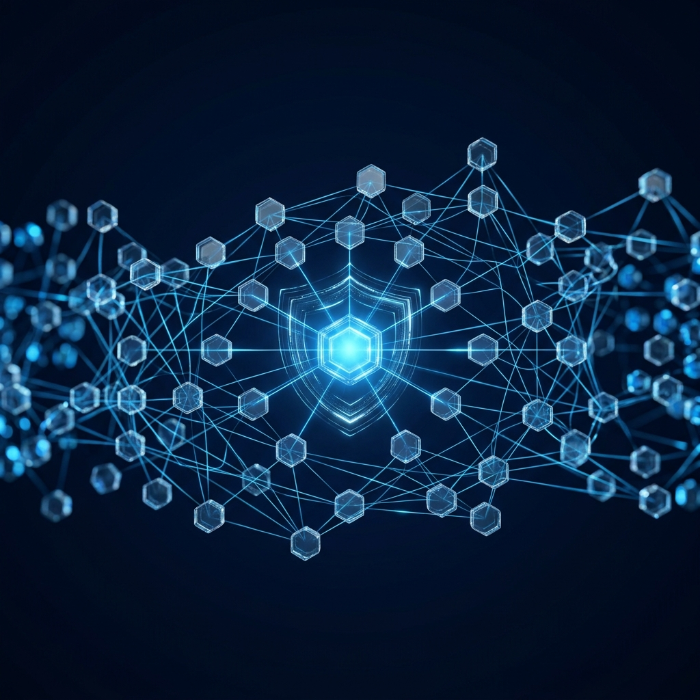
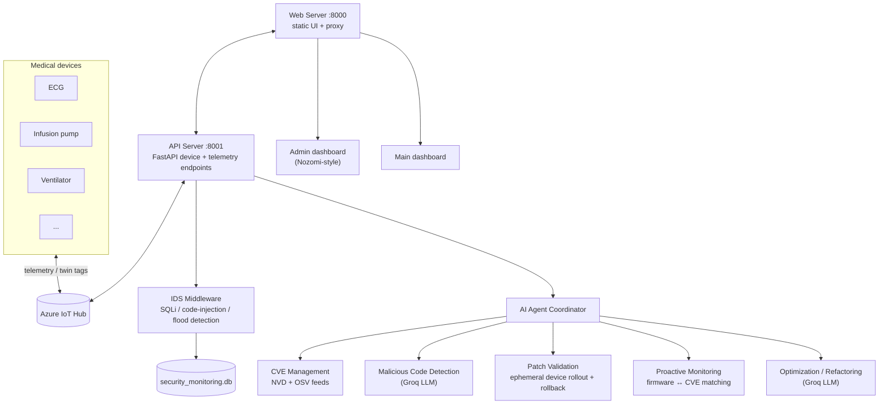

<p align="center">
  
</p>

# Azure IoT Medical Device Security Operations Center

<p align="center">
  
  
  
  
</p>

Registers and operates a fleet of medical IoT devices in Azure IoT Hub, then wraps them in an
autonomous security operations layer: a real-time intrusion detection system, live CVE tracking
against installed firmware/software, and a coordinated set of AI agents that detect malicious
code in incoming patches, validate and roll out updates on ephemeral test devices, and flag
optimization/refactoring opportunities in the codebase itself.

## What's actually in here

This started as a device-registration script (`register_iothub_devices.py`) and grew into a
microservices security platform. Three layers:

1. **Device layer** — registers medical devices (ECG, infusion pump, ventilator, defibrillator,
   glucometer, etc.) in Azure IoT Hub with manufacturer/OS/software twin tags, and simulates
   realistic telemetry per device type.
2. **Service layer** — a web server (port 8000) and API server (port 8001) in a
   proxy/microservice split, each with request logging, an intrusion detection middleware
   (SQLi/code-injection pattern matching, flood protection, IP blocking), and Chart.js-driven
   admin + user dashboards.
3. **Agent layer** — an `ai_agent_coordinator.py` orchestrates five autonomous agents on top of
   that: CVE ingestion, malicious-code detection, patch validation, proactive monitoring, and
   optimization/refactoring.

## Architecture



## Quick start

```bash
pip install -r requirements.txt
cp .env.example .env
# edit .env: IOTHUB_CONNECTION_STRING, GROQ_API_KEY (for the AI agents)

# 1. Register the device fleet
python register_iothub_devices.py

# 2. Start both servers
python api_server.py   # :8001
python main.py          # :8000
```

Then open `http://localhost:8000` for the main dashboard, or
`http://localhost:8001/admin` for the security-focused admin view
(`http://localhost:8001/docs` for the Swagger API reference).

Send test telemetry:

```bash
python telemetry_client.py --continuous --interval 10
```

## AI agents

| Agent | File | Does |
|---|---|---|
| Coordinator | `ai_agent_coordinator.py` | Orchestrates the agents below into one pipeline |
| CVE Management | `cve_management_system.py`, `osv_cve_fetcher.py` | Pulls from NVD + OSV, stores in `data/cve_database.db` |
| Proactive Monitoring | `proactive_monitoring_agent.py` | Matches installed firmware/software against fetched CVEs, early-warns on exposure |
| Malicious Code Detection | `malicious_code_detection_agent.py` | Scans incoming patches/firmware for malicious patterns via Groq |
| Patch Validation | `patch_validation_agent.py` | Deploys patches to ephemeral IoT Hub test devices, validates, rolls back on failure |
| Optimization | `optimization_agent.py` | Profiles system performance, flags bottlenecks |
| Code Refactoring | `code_refactoring_agent.py` | Reviews code quality against the project's own standards |

## API endpoints

**Devices** — `GET /api/devices`, `GET /api/devices/{id}`, `POST /api/devices/connect`,
`POST /api/devices/disconnect`, `PATCH /api/devices/{id}`

**Telemetry** — `POST /api/telemetry/send`, `POST /api/telemetry/continuous`,
`GET /api/telemetry/sample/{device_type}`

**Security/Admin** — `GET /admin/ids/overview`, `GET /admin/ids/analytics`,
`GET /admin/ids/events`, `GET /admin/ids/blocked-ips`

## Testing

```bash
python test_architecture.py      # microservice wiring
python test_ids_security.py      # IDS detection rules
python test_dashboard_data.py    # dashboards show live, not hardcoded, data
python test_cve_system.py        # CVE fetch/match pipeline
```

## Notes

- Idempotent device registration: re-running `register_iothub_devices.py` reuses existing keys
  and only updates twin tags.
- `.env` is gitignored — never commit a real `IOTHUB_CONNECTION_STRING` or `GROQ_API_KEY`.
  Rotate immediately if one is ever exposed.
- See `ARCHITECTURE_SUMMARY.md` and `README_COMPLETE.md` for the original microservices refactor
  writeups this consolidates.
